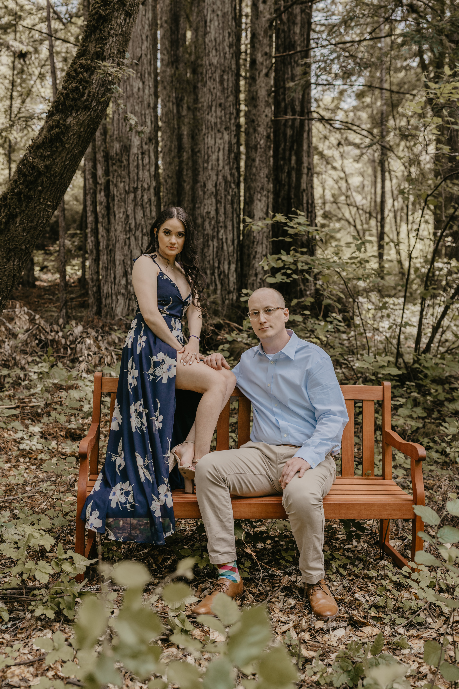

<h1>Maria & Jon's Wedding</h1>

<h4>Where am I?</h4>

You likely flew into SJC Airport in San Jose, California and are close to the downtown area.

<h4>What is there to do here?</h4>

You are close to several great cities with many things to do and checkout:

- **San Jose**

	- Many well-known tech companies are based out of the Bay Area, specifically in San Jose
		- [Apple Visitor Center](https://www.google.com/maps/place/Apple+Apple+Park+Visitor+Center/@37.3327772,-122.0075731,17z/data=!3m1!4b1!4m5!3m4!1s0x808fb5c5d7e7a3d1:0x1741de234d732f80!8m2!3d37.332773!4d-122.0053844)
		- [Facebook](https://www.google.com/maps/place/Meta+Headquarters/@37.4850772,-122.1504711,17z/data=!3m1!4b1!4m5!3m4!1s0x808fbc96de8dc419:0x64979e438bf4e3a5!8m2!3d37.485073!4d-122.1482824)
		- [Google](https://www.google.com/maps/place/Googleplex/@37.4220698,-122.0862784,17z/data=!3m1!4b1!4m5!3m4!1s0x808fba02425dad8f:0x6c296c66619367e0!8m2!3d37.4220656!4d-122.0840897)
		- [LinkedIn](https://www.google.com/maps/place/Linkedin+HQ+-+Logo/@37.3925533,-122.0437637,17z/data=!3m1!4b1!4m5!3m4!1s0x808fb75063a5689b:0x11eda989e545057c!8m2!3d37.3925491!4d-122.041575)
		- [Nvidia](https://www.google.com/maps/place/NVIDIA+Corporation/@37.3706296,-121.9693781,17z/data=!3m1!4b1!4m5!3m4!1s0x808fca2702c480db:0x76527847b95e08c9!8m2!3d37.3706254!4d-121.9671894)
		- ... and many more!
	- [San Pedro Square Market](https://www.google.com/maps/place/San+Pedro+Square+Market+Bar/@37.3365008,-121.896501,17z/data=!3m1!4b1!4m5!3m4!1s0x808fcca243df74c3:0x9d87f2c429f5e3a5!8m2!3d37.3364966!4d-121.8943123) is a good spot to get some food. It is comprised several bars, restaurants and shops and is located in downtown San Jose near the airport.
	- [Santana Row](https://www.google.com/maps/place/Santana+Row/@37.3198954,-121.950533,17z/data=!3m1!4b1!4m5!3m4!1s0x808fcb207b07b429:0xa3792edc2d5f8e0d!8m2!3d37.3198912!4d-121.9483443) is a more upscale shopping area with a movie theater, Best Buy, Amazon store, etc. It is also within walking distance of San Jose's best mall, [Valley Fair](https://www.google.com/maps/place/Westfield+Valley+Fair/@37.3227196,-121.9490739,17z/data=!3m1!5s0x808fcb1fb331d9e7:0x486cece48a6a2220!4m12!1m6!3m5!1s0x808fcb207b07b429:0xa3792edc2d5f8e0d!2sSantana+Row!8m2!3d37.3198912!4d-121.9483443!3m4!1s0x808fcb1e50555555:0xcb5743551cf8265f!8m2!3d37.3252679!4d-121.9455308).

- **Santa Cruz (~45 min from San Jose)**

	- [Santa Cruz Beach Boardwalk](https://www.google.com/maps/place/Santa+Cruz+Beach+Boardwalk/@36.9643146,-122.0208726,17z/data=!3m1!4b1!4m5!3m4!1s0x808e40195645ec51:0x903bdc909334fa5!8m2!3d36.9643103!4d-122.0186839) is a small amusement park on the coast. Entry is free so you can sneak in and walk around or just eat deep-fried stuff if you want. Both the Boardwalk and Wharf are near each other.
	- [Santa Cruz Wharf](https://www.google.com/maps/place/Santa+Cruz+Wharf/@36.9615028,-122.0192418,17z/data=!4m12!1m6!3m5!1s0x808e40195645ec51:0x903bdc909334fa5!2sSanta+Cruz+Beach+Boardwalk!8m2!3d36.9643103!4d-122.0186839!3m4!1s0x0:0xf48e2c1896bb1e67!8m2!3d36.9572769!4d-122.0172773) is a pier in Santa Cruz with shops, restaurants and sea lions. Both the Boardwalk and Wharf are near each other.
	- Santa Cruz is one of the more popular beach areas in the Bay Area. Bring a jacket!
		- [Natural Bridges State Beach](https://www.google.com/maps/place/Natural+Bridges+State+Beach/@36.9483716,-122.0479867,16.71z/data=!4m12!1m6!3m5!1s0x808e40195645ec51:0x903bdc909334fa5!2sSanta+Cruz+Beach+Boardwalk!8m2!3d36.9643103!4d-122.0186839!3m4!1s0x808e6b995203b69d:0x12a76ae5f442aef1!8m2!3d36.9502805!4d-122.0575721)
		- [The Cave @ Seven Mile Beach](https://www.google.com/maps/place/The+Secret+Cave+of+Seven+Mile+Beach/@36.9794054,-122.1501732,15z/data=!4m12!1m6!3m5!1s0x808e40195645ec51:0x903bdc909334fa5!2sSanta+Cruz+Beach+Boardwalk!8m2!3d36.9643103!4d-122.0186839!3m4!1s0x808e434bd8ea4c55:0xf5f1a383db07516a!8m2!3d36.9886507!4d-122.1690317)
		- [Many other beaches along Hwy 1](https://www.google.com/maps/@37.035585,-122.1065524,12.67z)

- **Monterey (~1hr 15m from San Jose)**

	- [Monterey Bay Aquarium](https://www.google.com/maps/place/Monterey+Bay+Aquarium/@36.6057245,-121.8520275,13.79z/data=!3m1!5s0x808de4002ae6f111:0xd8f635cc0e9c3780!4m25!1m19!4m18!1m6!1m2!1s0x808fcae48af93ff5:0xb99d8c0aca9f717b!2sSan+Jose,+CA!2m2!1d-121.8852525!2d37.33874!1m6!1m2!1s0x808de6aa8166e4e3:0xb5a84a1997229b63!2smonterey+bay+aquarium!2m2!1d-121.9017919!2d36.618264!2m3!6e0!7e2!8j1659002400!3m4!1s0x808de6aa8166e4e3:0xb5a84a1997229b63!8m2!3d36.618264!4d-121.9017919) is a really nice aquarium alongside the Pacific Ocean and is near the [Old Fisherman's Wharf](https://www.google.com/maps/place/Old+Fisherman%27s+Wharf/@36.6057245,-121.8520275,13.79z/data=!3m1!5s0x808de4002ae6f111:0xd8f635cc0e9c3780!4m25!1m19!4m18!1m6!1m2!1s0x808fcae48af93ff5:0xb99d8c0aca9f717b!2sSan+Jose,+CA!2m2!1d-121.8852525!2d37.33874!1m6!1m2!1s0x808de6aa8166e4e3:0xb5a84a1997229b63!2smonterey+bay+aquarium!2m2!1d-121.9017919!2d36.618264!2m3!6e0!7e2!8j1659002400!3m4!1s0x808de41880edf8cd:0xdc0b163254a641c7!8m2!3d36.6037963!4d-121.8933703) area which will be very busy due to Monterey Car Week.
	- [Monterey Car Week](https://whatsupmonterey.com/article/activities/monterey-car-week-overview) is an annual car event attracting people and rare cars from around the world. Events take place all week with the highlights being the Concours d'Elegance and multiple car auctions.

- **San Francisco (~45 min from San Jose)**

	- Be careful in San Francisco! Unfortunately San Francisco has *very* high crime as of late.
		- Do not leave ANY items in your car under any circumstances (food, jackets, phone cables, etc.)
		- Thieves can tell if electronics (phones, computers, cameras) have been left in your car, even if in a trunk or under something.
		- Use [SpotHero](https://spothero.com/city/san-francisco-parking) and pay to park your vehicle somewhere safe (ex: a hotel). If necessary, take a Lyft from your parked car to more touristy areas.
		- Be aware of your surroundings!
	- With that being said, San Francisco is an international city with tons of cool sights
		- [Golden Gate Bridge](https://www.google.com/maps/place/Golden+Gate+Bridge/@37.8138749,-122.4793952,15.37z/data=!3m1!5s0x808de4002ae6f111:0xd8f635cc0e9c3780!4m25!1m19!4m18!1m6!1m2!1s0x808fcae48af93ff5:0xb99d8c0aca9f717b!2sSan+Jose,+CA!2m2!1d-121.8852525!2d37.33874!1m6!1m2!1s0x808de6aa8166e4e3:0xb5a84a1997229b63!2smonterey+bay+aquarium!2m2!1d-121.9017919!2d36.618264!2m3!6e0!7e2!8j1659002400!3m4!1s0x0:0xcded139783705509!8m2!3d37.8199286!4d-122.4782551) - Self explanatory. Although there is an official visitor center and viewing area, I personally prefer to go [up on the hill](https://www.google.com/maps/place/Golden+Gate+View+Point/@37.8291503,-122.4820813,16.83z/data=!3m1!5s0x808de4002ae6f111:0xd8f635cc0e9c3780!4m25!1m19!4m18!1m6!1m2!1s0x808fcae48af93ff5:0xb99d8c0aca9f717b!2sSan+Jose,+CA!2m2!1d-121.8852525!2d37.33874!1m6!1m2!1s0x808de6aa8166e4e3:0xb5a84a1997229b63!2smonterey+bay+aquarium!2m2!1d-121.9017919!2d36.618264!2m3!6e0!7e2!8j1659002400!3m4!1s0x80858429f49a5beb:0xa05820cc201717ff!8m2!3d37.8287328!4d-122.4860231) opposite of the Vista area. To get here go over the Bridge and through the tunnel. Exit at Sausalito and circle back towards the Bridge.
		- [Fisherman's Wharf](https://www.google.com/maps/place/Fisherman%27s+Wharf,+San+Francisco,+CA/@37.8019972,-122.4366327,15.37z/data=!3m1!5s0x808de4002ae6f111:0xd8f635cc0e9c3780!4m25!1m19!4m18!1m6!1m2!1s0x808fcae48af93ff5:0xb99d8c0aca9f717b!2sSan+Jose,+CA!2m2!1d-121.8852525!2d37.33874!1m6!1m2!1s0x808de6aa8166e4e3:0xb5a84a1997229b63!2smonterey+bay+aquarium!2m2!1d-121.9017919!2d36.618264!2m3!6e0!7e2!8j1659002400!3m4!1s0x808580fa79aee3b9:0xd0ce5b8bf914906a!8m2!3d37.8085761!4d-122.4125272) - San Francisco's most popular tourist area. Many shops, restaurants and bars. This is also the launch dock for tours of [Alcatraz Island](https://www.google.com/maps/place/Alcatraz+Island/@37.8175338,-122.4258136,15.25z/data=!3m1!5s0x808de4002ae6f111:0xd8f635cc0e9c3780!4m25!1m19!4m18!1m6!1m2!1s0x808fcae48af93ff5:0xb99d8c0aca9f717b!2sSan+Jose,+CA!2m2!1d-121.8852525!2d37.33874!1m6!1m2!1s0x808de6aa8166e4e3:0xb5a84a1997229b63!2smonterey+bay+aquarium!2m2!1d-121.9017919!2d36.618264!2m3!6e0!7e2!8j1659002400!3m4!1s0x808580f9b38c1c99:0xd15844a27f9a58a5!8m2!3d37.8269775!4d-122.4229555).

**Where is the wedding?**

[Morgan Hill, California](https://www.google.com/maps/place/Nob+Hill+Foods/@37.111745,-121.6379452,16.04z/data=!4m13!1m7!3m6!1s0x808e1e1fb1d09e6d:0x6812e93e20895cd5!2sMorgan+Hill,+CA!3b1!8m2!3d37.1305012!4d-121.6543901!3m4!1s0x808e206e612143ef:0x214307aeceaccc8a!8m2!3d37.1103558!4d-121.642424) -- approximately 30 minutes from San Jose

**When is the wedding?**

Saturday August 20th, 2022 @ 2:30p

**Will there be food?**
